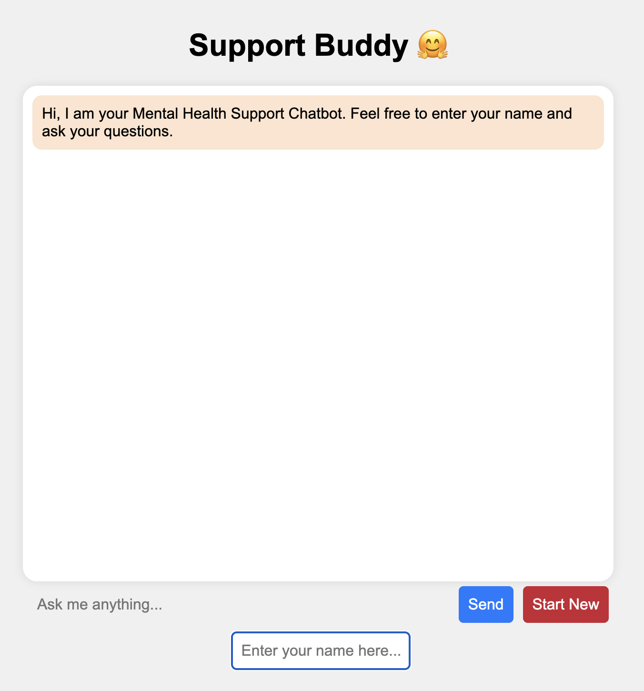

# Support Buddy

This project includes a Flask application and supporting scripts for a Mental Health Support Chatbot designed to provide counseling and therapy through encouraging and empathetic dialogue. It leverages a fine tuned model (palm/bison) that was trained and deployed on Google Cloud's Vertex AI platform to process user input and generate responses tailored to the context of mental health support within the UK.

## Project Structure

- `app.py`: The main Flask application script that serves the chat interface and handles communication between the user and the model.
- `model_initiate.py`: Contains functions for authenticating with Google Cloud and sending requests to the Vertex AI model endpoint.
- `templates/`: Folder containing HTML templates for the Flask app.
  - `chat.html`: The main chat interface presented to the user.
- `gcp_creds/`: Directory that should contain your Google Cloud service account key file. (create your own)
  - `igp-genai-7220e3ec9be8.json`: The service account key file (ensure this file is kept secure and not committed to your repository).

## Features

- **AI-Powered Responses**: Utilizes Vertex AI's powerful NLP models for generating conversational responses.
- **Mental Health Focus**: Tailored to provide mental health support with an empathetic and encouraging tone.
- **UK Context**: Offers suggestions and advice relevant to the UK, including local resources and practices.
- **User Greetings**: Dynamically responds to user-initiated greetings while focusing on the main conversation.

## Setup

### Requirements

- Python 3.6+
- Flask
- Requests
- Google Cloud SDK (for authentication with Vertex AI)

### Installation

1. **Clone this repository to your local machine.**

```git clone https://github.com/hussnain-imtiaz/supportBuddy.git```   
```cd supportBuddy```

2. **Install dependencies:**
```pip install -r requirements.txt```

3. **Set up Google Cloud credentials:**

Place your service account JSON key file in the `gcp_creds/` directory and update the path in `model_initiate.py` accordingly.

### Running the Application

1. **Start the Flask app:**
```python app.py```
  
## Usage

Interact with the chatbot through the web interface. The chatbot will respond based on its training and the context provided in `model_initiate.py`.

## Customization

To tailor the chatbot responses or integrate additional features, modify the `context` and parameters within `model_initiate.py`. Adjustments can also be made to `chat.html` for UI changes.

## Acknowledgments

- Google Cloud Vertex AI for the AI model backend.
- Flask for the web application framework. 


